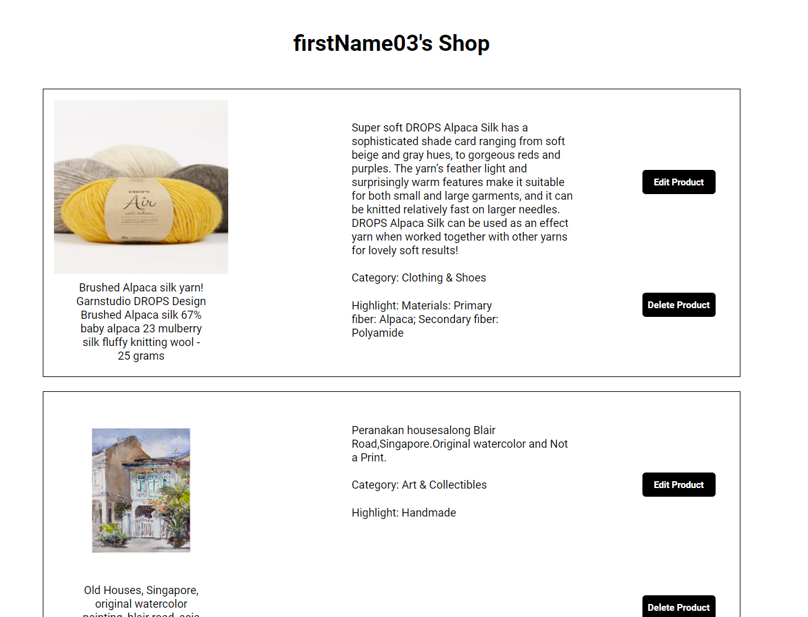

# Artsy

Artsy is a web-application clone inspired by [Etsy](https://www.etsy.com/), that allows users to purchase handmade products. It is also a place to sell crafty products to users who are interested.

* [Artsy](https://artsy-1014.herokuapp.com/)

### Please see below links to Project Wiki:
##### [API Documentation](https://github.com/haiyen2003/Etsy-clone/wiki/API-Documentation)
##### [Features](https://github.com/haiyen2003/Etsy-clone/wiki/Feature-List)
##### [Database Schema](https://github.com/haiyen2003/Etsy-clone/wiki/Database-Schema)
##### [User Story](https://github.com/haiyen2003/Etsy-clone/wiki/User-Story)
##### [Redux State](https://github.com/haiyen2003/Etsy-clone/wiki/Redux-State)

### This project is built with:

# Run Locally
  1) Clone this repository
  2) Frontend instruction: cd into react-app directory
     and run command : npm install
  3) Make an .env file under the root directory and copy the content of
     .env.example to the .env file.

  4) Backend instruction: open another terminal at the same time and run the
     following command in order :
     pipenv install -r requirements.txt
     In the following order:
     pipenv shell ; flask db upgrade ; flask seed all; flask run.
  5) With the second terminal, run npm start in the react-app directory.

# Features Direction
  HomePage
  

  Search Bar
  

  Category
  

  ProductDetail Page
  

  My Products Listing
  

  Create a listing
  

  My Reviews
 

  Create a review
  

  My Cart
  

# Future Focus
  1. For search bar, We would like to add the cancel button to clear out the search history at once and set the magnifying glass as a button to fetch all the results at an another page.

  2. Shipping and Delivery features.

  3. For cart feature, we will create a 'You might also like' session where we suggest similar items - using query by category

  4. We can also add favorites feature to all the products.
